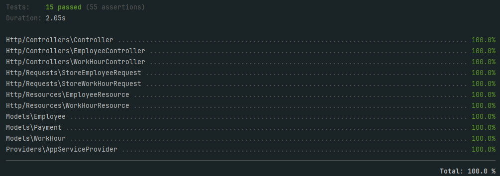

# Задача 1

## Установка и настройка

1. Клонируйте репозиторий и перейдите в директорию проекта:

    ```bash
    git clone https://github.com/infern397/test-task-first
    cd test-task-first
    ```

2. Установите зависимости:

    ```bash
    composer install
    ```

3. Создайте файл `.env` на основе `.env.example` и сгенерируйте ключ приложения:

    ```bash
    cp .env.example .env
    php artisan key:generate
    ```

4. Создайте файл базы данных database.sqlite в database/:

    ```bash
    touch database/database.sqlite
    ```

5. Запустите миграции для создания таблиц:

    ```bash
    php artisan migrate
    ```

6. Запустите локальный сервер разработки:

    ```bash
    php artisan serve
    ```

*В качестве базы данных используется SQLite*

## Использование API

### Создание сотрудника

- **Endpoint:** `POST /api/employees`
- **Пример запроса:**

    ```json
    {
        "email": "test@example.com",
        "password": "password"
    }
    ```

### Запись отработанных часов

- **Endpoint:** `POST /api/work-hours`
- **Пример запроса:**

    ```json
    {
        "employee_id": 1,
        "hours": 8
    }
    ```

### Получение невыплаченных сумм

- **Endpoint:** `GET /api/payments/unpaid`

### Выплата накопившихся сумм

- **Endpoint:** `POST /api/payments/pay`

## Тестирование

Проект включает тесты для проверки функциональности. Для запуска тестов выполните:

```bash
php artisan test
```

Для проверки покрытия кода тестами выполните:

```bash
php artisan test --coverage
```


